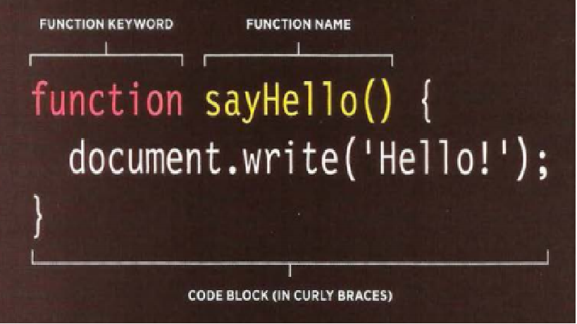
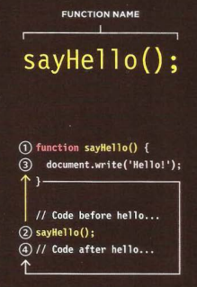

# Function 
 group a series of statements together to perform a specific task. If different parts of a script repeat the same task, you can reuse the function (rather than repeating the same set of statements

## **FUNCTION DECLARING :** To create a function , you give it a name and then write the statements needed to achieve its task inside the curly braces consist of:
1. Function Keyword
2. Identifier :. You give the function a name, followed by parenthese
3. The statements that perform the task sit in a code block . ( They are inside curly braces . )


## CALLING A FUNCTION 
* Having declared the function , you can then execute all of the statements between its curly braces with just one line of code 
* function name followed by parentheses
* In programmer - speak , you would say that this code calls a function
*  You can call the same function as many times as you want within the same JavaScript file .

 ## DECLARING FUNCTIONS THAT NEED INFORMATION
 * Sometimes a function needs specific information to perform its task .In such cases , when you declare the function you give it parameters . Inside the function , the parameters act like variables 
 * parameters: items that appear inside these parentheses 
 * Inside the function those words act like variable names

 * This function will calculate and return the area of a rectangle . To do this , it needs the rectangle's width and height . Each time you call the function these values could be different .

 ## CALLING FUNCTIONS THAT NEED INFORMATION
 When you call a function that has parameters , you specify the values it should use in the parentheses that follow its name . The values are called **arguments** , and they can be provided as values or as variables .


 **ARGUMENTS AS VALUES** When the function below is called , the number 3 will be used for the width of the wall , and I will be used for its height
getArea(3,5);

**ARGUMENTS AS VARIABLES** You do not have to specify actual values when calling a function - you can use variables in their place . So the following does the same thing

```
WallWidth = 3;
WallHeght = 5;
getArea(WallWidth,WallHeght);
```

## GETTING A SINGLE VALUE OUT OF A FUNCTION
- Some functions return information to the code that called them For example , when they perform a calculation , they return the result .
- This calculatarea ( ) function returns the area of a rectangle to the code that called it .
- Inside the function , a variable called area is created . It holds the calculated area of the box . 
- The return keyword is used return a value to the code that called the function . 
```
fuvction calculateArea(width, height){
    var area = width * height ;
    return area;
}
var wallone = calculateArea(3, 5);
var walltwo = calculateArea(8, 5);
```
- Result : wallone=15 & walltwo=40
- This also demonstrates how the same function can be used to perform the same steps with different values
