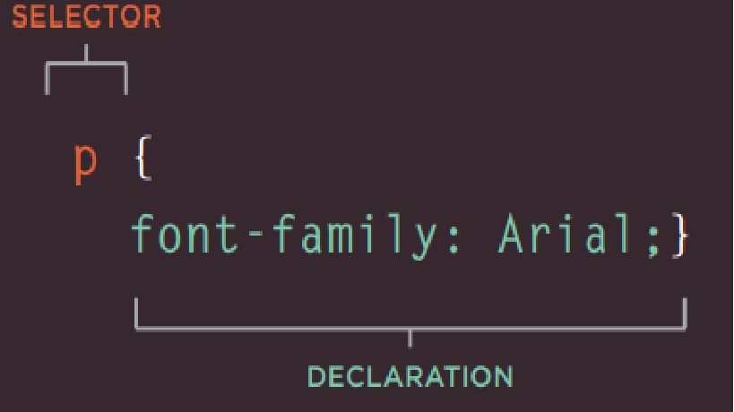
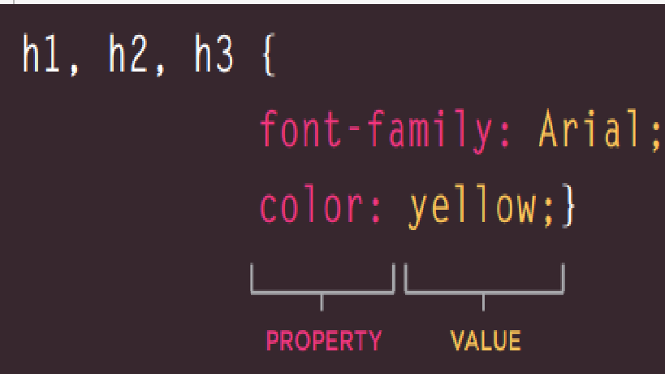

# class-02
## CH2 Text
## Headings
 HTML has six "levels" of headings ```<h1>``` is used for main headings ```<h2>``` is used for subheadings

## Paragraphs
To create a paragraph, surround the words that make up the paragraph with an opening  ```<p> ``` tag and closing  ```</p> ``` tag.

## Bold & It alic
* By enclosing words in the tags ```<b>``` and ```</b>``` we can make characters appear bold

* By enclosing words in the tags ```<i>``` and ```</i>``` we can make characters appear italic

## Superscript &Subscript
* The ```<sup>``` element is used to contain characters that should be superscript such as the suffixes of dates or mathematical concepts like raising a number to a power 
* The ```<sub>``` element is used to contain characters that should be subscript. It is commonly used with foot notes or chemical formulas 
## Line Breaks & Horizontal Rules
* As you have already seen, the browser will automatically show each new paragraph or heading on a new line. But if you wanted to add a line break inside the middle of a paragraph you can use the line break tag 
```<br />```
* To create a break between themes — such as a change of topic in a book or a new scene in a play — you can add a horizontal rule between sections using the ```<hr />``` tag.

## Changes to Content
* The ```<ins>``` element can be used to show content that has been inserted into a document ,the content is usually underlined
* the ```<del>``` element can show text that has been deleted from it, the content is usually has a line through it.
* The ```<s>``` element indicates something that is no longer accurate or relevant (but that should not be deleted).

## Summary
* HTML elements are used to describe the structure of the page (e.g. headings, subheadings, paragraphs).
* They also provide semantic information (e.g. where emphasis should be placed, the definition of any acronyms used, when given text is a quotation).


# CH10 Introducing CSS
## CSS works by associating rules with HTML elements. These rules govern
how the content of specified elements should be displayed. A CSS rule
contains two parts: a selector and a declaration.

**Selectors** indicate which element the rule applies to.

**Declarations** indicate how the elements referred to in the selector should be styled. Declarations are split into two : parts (a property and a value), and are separated by a colon.

 

## CSS Properties Affect How Elements Are Displayed
CSS declarations sit inside curly brackets and each is made up of two
parts: a property and a value, separated by a colon. You can specify
several properties in one declaration, each separated by a semi-colon.

**Properties** indicate the aspects of the element you want to change. For example, color, font, width, height and border.

**Values** specify the settings you want to use for the chosen properties. For example, if you want to specify a color property then the value is the color you want the text in these elements to be.



*CSS rules usually appear in a separate document, although they may appear within an HTML page*

## Summary
* CSS treats each HTML element as if it appears inside its own box and uses rules to indicate how that element should look.
* Rules are made up of selectors (that specify the elements the rule applies to) and declarations (that indicate what these elements should look like).
* Different types of selectors allow you to target your rules at different elements.
* Declarations are made up of two parts: the properties of the element that you want to change, and the values of those properties. For example, the font-family property sets the choice of font, and the value arial specifies Arial as the preferred typeface.
* CSS rules usually appear in a separate document, although they may appear within an HTML page.


## CH2 JavaScript Instructions
### statement: Each individual instruction or step in series of instructions that a computer can follow one-by-one it *should end with a semicolon* .

* the colors in JS statment
- Each of the lines of code in green is a statement.
- The pink curly braces indicate the start and end of a code block. (Each code block could contain many more statements.)
- The code in purple determines which code should run 


## COMMENTS :
- to explain what your code does
- They help make your code easier to read and understand
- This can help you and others who read your code.
## There is to Tayps og comments :
1. MULTI-LINE COMMENTS : starting with the ```/*``` characters and ending with the ```* / ```characters.
2. SINGLE-LINE COMMENTS :anything that follows the two forward slash characters ```//```

## VARIABLE
* temporarily store the bits of information it needs to do its job
* the data stored in a variable can change (or vary) each time a script runs

## Declaration of Variables: 


## Assigning Value of Variables:


## DATA TYPES
1. **STRING** *like* 's.th'
2. **Numbers** *Like* (.75, 1000 , 4 , -50)
3. **BOOLEAN** can have one of two va lues: true or false

### Variables can store any tapes of data (string , numbers , boolean)

## ARRAYS 
* An array is a special type of variable. It doesn't just store one value; it stores a list of values.
* Values in an array are accessed as if they are in a numbered list. It is important to know that the numbering of this list starts at zero (not one).

```var colors;```

```colors=['white', 'black', ' custom '];```

```index =( 0     ,    1   ,     2     )```
- Each item in an array is automatically given a number called an index. This can be used to access specific items in the array. Consider the following array which holds three colors:

**from Index**
```colors[2] = 'black ' ;```

## EXPRESSIONS
* evaluates into (results in) a single value. Broadly speaking there are two types of expressions
* ```var color = 'beige';``` The value of co 1 or is now beige.
* ```var area = 3 * 2;``` The value of area is now 6.
* ```buy = 3 > 5;``` The value of buy is fa 1 se.
* ```area = 5 * 2;``` The value of area is now 10.
* ```buy= (5 > 3) && (2 < 4);``` The value of buy is now true.
* ```greeting= 'Hi 1 + 'Mol ly';```The value of greeting is now Hi Molly.
 ```var cost l = '7';```

```var cost2 = '9 ' ;```

```var total = costl + cost2 ;```
 **The value is string '79'**

```var number = 12;```
```var street= 'Ivy Road';```

```var add = number + street;```

 **The value is string '12Ivy Road'**

```var score= ' seven ';```

```var score2 = ' nine';```

```var total = score * score2;```
**The value is NaN(Not Number)**

## Summary
- A script is made up of a series of statements. Each statement is like a step in a recipe.
- Scripts contain very precise instructions. For example, you might specify that a value must be remembered 
- Variables are used to temporarily store pieces of information used in the script.before creating a calculation using that value.
- Arrays are special types of variables that store more than one piece of related information.
- JavaScript distinguishes between numbers (0-9), strings (text), and Boolean values (true or false).
- Expressions evaluate into a single value.
- Expressions rely on operators to calculate a value.

## CH4 Decisions and Loops
### SWITCH STATEMENTS
* A switch statement starts with a variable called the switch value.
* Each case indicates a possible value for this variable
* the code that should run if the variable matches that value.
```switch (level) {```

```case 'O ne ':```

```title= 'Level 1 ' ;```

```break;```

```case 'Two':```

```tit 1 e = ' Level 2 ' ;```

```break;```

```case ' Three' :```

```title = 'Level 3' ;```

```break ;```

```default :```

```title= 'Test';```

```break;```

```SWITCH```

```}```

**Difference Between IF...Else & Switch**


|IF...Else                                    |Switch                                                  |
|---------------------------------------------|--------------------------------------------------------|
|There is no need to provide an el se option  |default option that is run if none of the cases match   |
|so it performs more slowly than switch       |providing better performance than multiple if statements|
