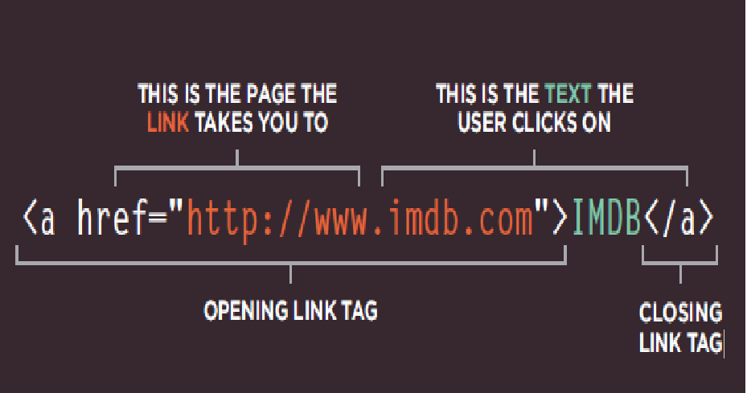
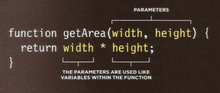

# CH4 Links

## Writing Links 
* Links are created using the ```<a>``` element. Users can click on anything
between the opening ```<a>``` tag and the closing ```</a>``` tag. You specify
which page you want to link to using the href attribute 



* you can make 
1. Linking to Other Sites
```<a href="http://www.empireonline.com">Empire</a>```
2. Linking to Other Pages on the Sa me Site
```<a href="index.html">Home</a>```
3.Email Links
```<a href="mailto:jon@example.org">Email Jon</a>```
4. Op ening Links in a New Window
```<a href="http://www.imdb.com" target="_blank">Internet Movie Database</a>```
## Summary

*  Links are created using the ```<a>``` element. 
* The ```<a>``` element uses the href attribute to indicate the page you are linking to.
* If you are linking to a page within your own site, it is best to use relative links rather than qualified URLs
* You can create links to open email programs with an email address in the "to" field
* You can use the id attribute to target elements within a page that can be linked to.


# CH5 Layout
## Key Concepts in Positioning Elements
* CSS treats each HTML element as if it is in its own box. This box will either be a block-level box or an inline box
- Block-level boxes start on a new line and act as the main building blocks of any layout
- inline boxes flow between surrounding text. You can control how much space each box takes up by setting the width of the boxes , To separate boxes, you can use borders, margins, padding, and background colors.

* **Containing Elements**: If one block-level element sits inside another block-level element then the outer box is known as the containing or parent element.

## Controll ing the Position of El ements

CSS has the following positioning schemes that allow you to control the layout of a page: 
1. normal flow
2. relative positioning
3. absolute positioning. 
* You can also float elements using the float property.

## box offset
* To indicate where a box should be positioned,properties to tell the browser how far from the top or bottom
and left or right it should be placed.
* When you move any element from normal flow, boxes can overlap. The z-index property allows you to control which box appears on top,There are two types:

1. Fixed Positioning
2. Floating Elements

## Screen Sizes
Different visitors to your site will have different sized screens that show different amounts of information, so your design needs to be able to work on a range of different sized screens.

## Screen Resolution
Resolution refers to the number of dots a screen shows per inch. Some devices have a higher resolution than desktop computers and most operating systems allow users to adjust the resolution of their screens
## Page Sizes
Because screen sizes and display resolutions vary so much, web designers often try to create pages of around 960-1000 pixels wide (since most users will be able to see designs this wide on their screens).

## Fixed Width Layouts
Fixed width layout designs do not change size as the user increases or decreases the size of their browser window. Measurements tend to be given in pixels.

## Liquid Layouts
Liquid layout designs stretch and contract as the user increases or decreases the size of their browser window. They tend to use percentages.
## Summary
* ```<div>``` elements are often used as containing elements to group together sections of a page.
* Browsers display pages in normal flow unless you specify relative, absolute, or fixed positioning.
* The float property moves content to the left or right of the page and can be used to create multi-column layouts. (Floated items require a defined width.)
* Pages can be fixed width or liquid (stretchy) layouts
* Designers keep pages within 960-1000 pixels wide, and indicate what the site is about within the top 600 pixels (to demonstrate its relevance without scrolling).
* Grids help create professional and flexible designs
* CSS Frameworks provide rules for common tasks.
* You can include multiple CSS files in one page. 

# CH3 Functions, Methods, and Objects
## Functions
let you group a series of statements together to perform a specific task. If different parts of a script repeat the same task, you can reuse the function

 **FUNCTION DECLARING :** To create a function , you give it a name and then write the statements needed to achieve its task inside the curly braces consist of:
1. Function Keyword
2. Identifier :. You give the function a name, followed by parenthese
3. The statements that perform the task sit in a code block . ( They are inside curly braces . )


## CALLING A FUNCTION 
* Having declared the function , you can then execute all of the statements between its curly braces with just one line of code 
* function name followed by parentheses
* In programmer - speak , you would say that this code calls a function
*  You can call the same function as many times as you want within the same JavaScript file .

 ## DECLARING FUNCTIONS THAT NEED INFORMATION
 * Sometimes a function needs specific information to perform its task .In such cases , when you declare the function you give it parameters . Inside the function , the parameters act like variables 
 * parameters: items that appear inside these parentheses 
 * Inside the function those words act like variable names

 * This function will calculate and return the area of a rectangle . To do this , it needs the rectangle's width and height . Each time you call the function these values could be different .

 ## CALLING FUNCTIONS THAT NEED INFORMATION
 When you call a function that has parameters , you specify the values it should use in the parentheses that follow its name . The values are called **arguments** , and they can be provided as values or as variables .


 **ARGUMENTS AS VALUES** When the function below is called , the number 3 will be used for the width of the wall , and I will be used for its height
getArea(3,5);

**ARGUMENTS AS VARIABLES** You do not have to specify actual values when calling a function - you can use variables in their place . So the following does the same thing

```
WallWidth = 3;
WallHeght = 5;
getArea(WallWidth,WallHeght);
```

## GETTING A SINGLE VALUE OUT OF A FUNCTION
- Some functions return information to the code that called them For example , when they perform a calculation , they return the result .
- This calculatarea ( ) function returns the area of a rectangle to the code that called it .
- Inside the function , a variable called area is created . It holds the calculated area of the box . 
- The return keyword is used return a value to the code that called the function . 
```
fuvction calculateArea(width, height){
    var area = width * height ;
    return area;
}
var wallone = calculateArea(3, 5);
var walltwo = calculateArea(8, 5);
```
- Result : wallone=15 & walltwo=40
- This also demonstrates how the same function can be used to perform the same steps with different values

## GETTING MULTIPLE VALUES OUT OF A FUNCTION
Functions can return more than one value using an array. For example, this function calculates the area and volume of a box
```function getSize (width, height, depth) {```

```var area = width * height;```

```}```

```var volume = width * height * depth;```

```var sizes= [area , volume];```

```return sizes;```

```var areaOne = getSize (3, 2, 3)[0];```

```var volumeOne = getSize (3, 2, 3)[1];```


