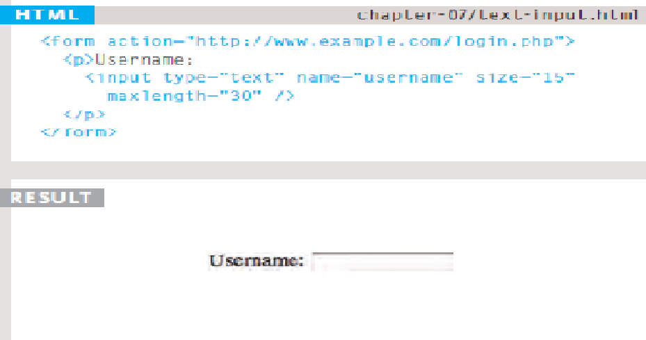

# ch7 :Forms 

## Form Structure
Form controls live inside a ```<form>``` element. This element should always carry the action attribute and will usually have a method and id attribute too.

1. action
Every <form> element requires an action attribute. Its value is the **URL** for the page on the server that will receive the information in the form when it is submitted.
2. method
Forms can be sent using one of two methods: **get** or **post**

## Text Input
The ```<input>``` element is used to create several different form controls. The value of the type attribute determines what kind of input they will be creating


## Summary FORMS

1. Whenever you want to collect information from visitors you will need a form which lives inside a < form > element.
2. Information from a form is sent in name/value pairs.
3. Each form control is given a name, and the text the user types in or the values of the options they select are sent to the server.
4. HTML5 introduces new form elements which make it
easier for visitors to fill in forms.


# CSS Lists, Tables & Forms

* In addition to the CSS properties which work with the contents of all elements, there are several others that are specifically used to control the appearance of lists, tables, and forms.

* List markers can be given different appearances using the list-style-type and list-style image properties.

* Table cells can have different borders and spacing in different browsers, but there are properties you can use to control them and make them more consistent.

* Forms are easier to use if the form controls are vertically aligned using CSS.

* Forms benefit from styles that make them feel more interactive.

## HTML tables
Tables can be a useful way of organising content on a web page, particularly text.

A table is defined with the`` < table >`` tag. Each row in the table is defined with the ``< tr >`` tag. A table heading is defined with the ``< th >`` tag. (Headings are bold and centred by default.) Each cell of data in the table is defined with the ``< td >`` tag.

# JavaScript Events
* HTML events are “things” that happen to HTML elements.

* When JavaScript is used in HTML pages, JavaScript can “react” on these events.

  1. An HTML event can be something the browser does, or something a user does. For examples:
  2. An HTML web page has finished loading
  3. An HTML input field was changed
* An HTML button was clicked
Common HTML events : onchange, onclick, onmouseover, onmouseout, onkeydown, onload.

