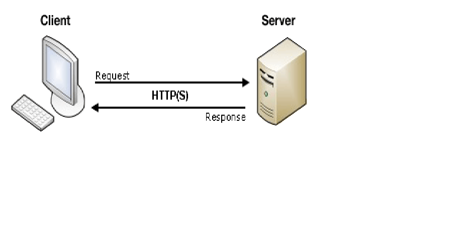

# SENDING FORM DATA

**Sending form data**
* a client (usually a web browser) sends a request to a server
* An HTML form on a web page is nothing more than a convenient user-friendly way to configure an HTTP
* The method attribute
1. GET
2. POST
3. UPDAT
4. DELETE

**The GET method** is the method used by the browser to ask the server to send back a given resource: "Hey server, I want to get this resource.
**The POST method** is a little different. It's the method the browser uses to talk to the server when asking for a response that takes into account the data provided in the body of the HTTP request
