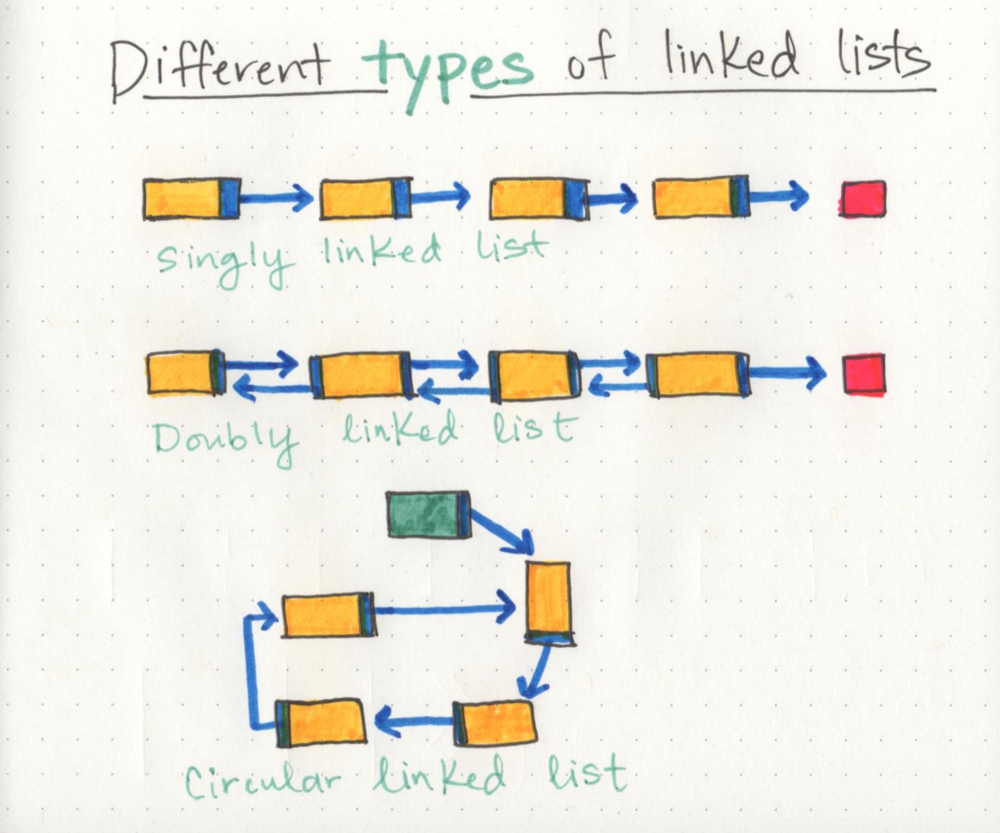
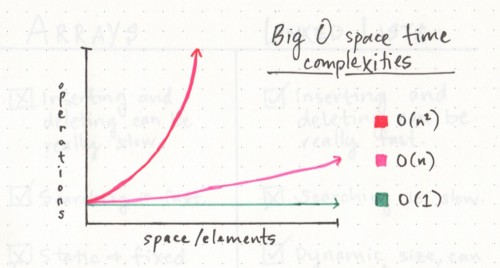

# Linked Lists

* **Linked Lists**: A Linked List is a sequence of Nodes that are connected/linked to each other. The most defining feature of a Linked List is that each Node references the next Node in the link.

* types of Linked Lists:
    1.  Singly and Doubly
    2.  Singly and Doubly

* **Linked List** - A data structure that contains nodes that links/points to the next node in the list.
* **Singly** - Singly refers to the number of references the node has. A Singly linked list means that there is only one reference, and the reference points to the Next node in a linked list.

* **Doubly** - Doubly refers to there being two (double) references within the node. A Doubly linked list means that there is a reference to both the Next and Previous node.

* **Node** - Nodes are the individual items/links that live in a linked list. Each node contains the data for each link.

* **Next** - Each node contains a property called Next. This property contains the reference to the next node.

* **Head** - The Head is a reference of type Node to the first node in a linked list.

* **Current** - The Current is a reference of type Node to the node that is currently being looked at. When traversing, you create a new Current variable at the Head to guarantee you are starting from the beginning of the linked list.

## **Traversal**
*  not able to use a foreach or for loop
* Next value in each node to guide us where the next reference is pointing
* best way to approach a traversal is through the use of a while() loop,allows us to continually check that the Next node in the list is not null.

## Traversal:
1. We are first creating Current at the Head to guarantee we are starting from the beginning.
2. We create a while loop. This loop will only run if the node that Current is pointing to is not null. This also means we can guarantee that we are still looking at a Node while the loop is running.
3. Once we are in the while loop, we are checking if the value of the current node is equal to the value we are looking for. Given the logic, if that condition is true, then we have found the value we were looking for, so we return true.
4. f the Current node does not contain the value we are looking for, we then must move Current to the next node that is being referenced. 
5. At this point, the while loop is re-evaluated. Step 3 & 4 will continue until Current reaches the end of the LinkedList. 
6. Once we hit the end, we know that we did not find the value and return true at any point, so the value is not in the LinkedList. We return false.

## Traversal Big O
* The Big O of time for Includes would be ``O(n)``;because, at its worse case, the node we are looking for will be the very last node in the linked list. n represents the number of nodes in the linked list.
* The Big O of space for Includes would be ``O(1)``;This is because there is no additional space being used than what is already given to us with the linked list input.

## Adding a Node O(n)
Adding a node to the middle of a linked list is a bit different than adding to the beginning. This is because we are working with more nodes and must re-allocate to make room for the new node.

## Parts of a linked list
1. **a series of nodes**
2. **head**:starting point of the list is a reference to the first nod 
3. The end of the list isn’t a node, but rather a node that points to null
4. single node is  has just two parts: **data**, or the information that the node contains, and a reference to the next node.

# what even is Big O?
* is a way of evaluating the performance of an algorithm.
* There are two major points to consider when thinking about how an algorithm performs: how much time it requires at runtime given how much time and memory it needs.
*  Big O  express the amount of time that a function, action, or algorithm takes to run based on how many elements we pass to that function.
* That’s exactly what Big O Notation takes into account: the speed and efficiency with which something functions when its input grows to be any (crazy big!) size.

* **types:** 
    1. **O(1) function** takes constant time, which is to say that it doesn’t matter how many elements we have, or how huge our input is: it’ll always take the same amount of time and memory to run our algorithm. 
    2. **O(n) function** is linear, which means that as our input grows (from ten numbers, to ten thousand, to ten million), the space and time that we need to run that algorithm grows linearly.
    3.  **O(n²) function**, which clearly takes exponentially more time and memory the more elements that you have. It’s pretty safe to say that we want to avoid O(n²) algorithms, just from looking at that crazy red line!

    