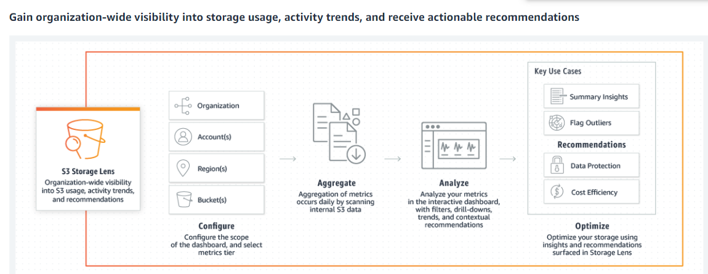
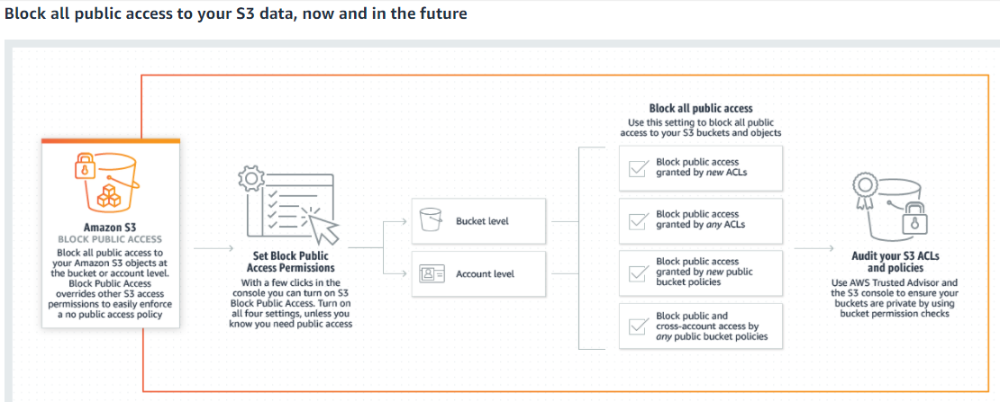

# AWS: S3 and Lambda
 

 # Amazon S3
 * **Amazon S3**Amazon Simple Storage Service  is an object storage service that offers industry-leading scalability, data availability, security, and performance. This means customers of all sizes and industries can use it to store and protect any amount of data for a range of use cases, such as data lakes, websites, mobile applications, backup and restore, archive, enterprise applications, IoT devices, and big data analytics. 

 ## S3 features
 * **S3 Object Lambda** You can add your own code to process data retrieved from S3 before returning it to an application

 

 * **S3 Storge Lens** delivers organization-wide visibility into object storage usage, activity trends, and makes actionable recommendations to improve cost-efficiency and apply data protection best practices.

 

* **S3 Intelligent-Tiering** optimizes storage costs by automatically moving objects between four access tiers when access patterns change.

 

* **Amazon S3 Access Points** simplifies managing data access at scale for applications using shared data sets on S3.

 

* **S3 Batch Operations** is an Amazon S3 data management feature that lets you manage billions of objects at scale with just a few clicks in the Amazon S3 Management Console or a single API request.

 

* **S3 Block Public Access** provides controls across an entire AWS Account, or at the individual S3 bucket level to ensure that objects never have public access, now and in the future.

 

## AWS Lambda

* **AWS Lambda**is a serverless computing service provided by Amazon Web Services (AWS). Users of AWS Lambda create functions, self-contained applications written in one of the supported languages and runtimes, and upload them to AWS Lambda, which executes those functions in an efficient and flexible manner.

*  Lambda can perform any kind of computing task, from serving web pages and processing streams of data to calling APIs and integrating with other AWS services.

* concept of “serverless” computing refers to not needing to maintain your own servers to run these functions.

* serverless computing refers to not needing to maintain your own servers to run these functions. the network layer and the rest of the infrastructure have already been taken care of, so that you can focus on writing application code.

* **Benefits of using AWS Lambda**
1. **Pay per use**. In AWS Lambda, you pay only for the compute your functions use, plus any network traffic generated. For workloads that scale significantly according to time of day, this type of billing is generally more cost-effective.

2. **Fully managed infrastructure**. Now that your functions run on the managed AWS infrastructure, you don’t need to think about the underlying servers—AWS takes care of this for you. This can result in significant savings on operational tasks such as upgrading the operating system or managing the network layer.

3. **Automatic scaling**. AWS Lambda creates the instances of your function as they are requested. There is no pre-scaled pool, no scale levels to worry about, no settings to tune—and at the same time your functions are available whenever the load increases or decreases. You only pay for each function’s run time.

4. **Tight integration with other AWS products** AWS Lambda integrates with services like DynamoDB, S3 and API Gateway, allowing you to build functionally complete applications within your Lambda functions.

## Content Delivery Network (CDN)
* **CDN** is a geographically distributed group of servers that work together to provide fast delivery of Internet content. A CDN allows for the fast transfer of data needed for loading Internet content including HTML pages, javascript files, stylesheets, images, and videos.

* main reasons why company want to use CDNs are to improve Internet website load speeds, content delivery speeds

# Q
1. Describe “The Cloud”
* refers to servers that are accessed over the Internet, and the software and databases that run on those servers. ... By using cloud computing, users and companies don't have to manage physical servers themselves or run software applications on their own machine

2. What is a container (as it relates to computers and servers)?
- Containers are a solution to the problem of how to get software to run reliably when moved from one computing environment to another.
- container consists of an entire runtime environment: an application, plus all its dependencies, libraries and other binaries, and configuration files needed to run it, bundled into one package.

3. What is auto-scaling?
- different resources respond to changes in demand

4. What is bandwidth?
-  is the amount of data that can be transferred from one point to another within a network in a specific amount of time

5. How do cloud providers compute service costs?
- When setting price, cloud providers determine the expense to maintaining the network. They start by calculating costs for network hardware, network infrastructure maintenance, and labor. These expenses are added together and then divided by the number of rack units a business will need for its IaaS cloud

# Terms 
* **Server instance**collection of SQL Server databases which are run by a solitary SQL Server service or instance
* **Containers** consists of an entire runtime environment
* **cloud services** refers to a wide range of services delivered on demand to companies and customers over the internet.
* **Cloud Architecture** refers to the various components in terms of databases, software capabilities, applications etc
* **AWS** Amazon Web Services
* **EC2/Beanstalk vs Heroku** 
    1. Amazon Web Services (AWS) and Heroku are two commonly used cloud services that let us deploy, monitor, and scale web and mobile apps. 
    2. Both services provide us with cloud computing resources and are great for hosting applications.
     

