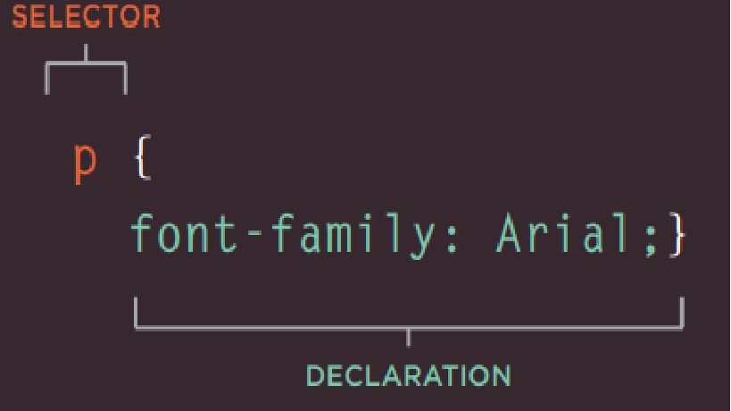
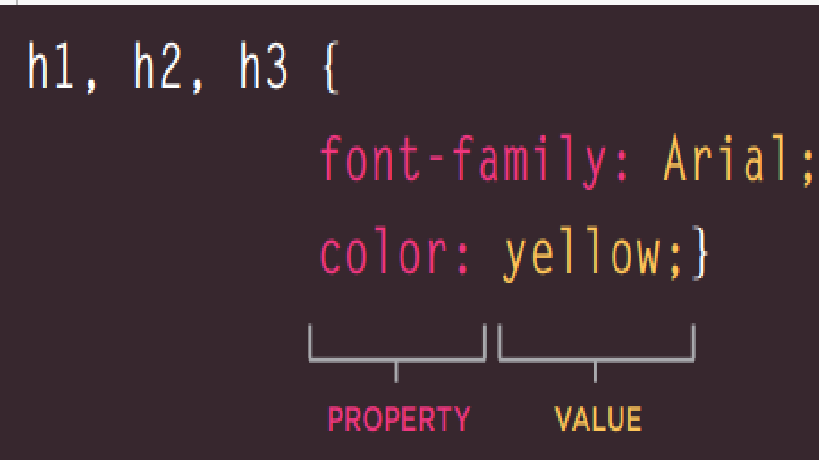

# class-02
## CH2 Text
## Headings
 HTML has six "levels" of headings ```<h1>``` is used for main headings ```<h2>``` is used for subheadings

## Paragraphs
To create a paragraph, surround the words that make up the paragraph with an opening  ```<p> ``` tag and closing  ```</p> ``` tag.

## Bold & It alic
* By enclosing words in the tags ```<b>``` and ```</b>``` we can make characters appear bold

* By enclosing words in the tags ```<i>``` and ```</i>``` we can make characters appear italic

## Superscript &Subscript
* The ```<sup>``` element is used to contain characters that should be superscript such as the suffixes of dates or mathematical concepts like raising a number to a power 
* The ```<sub>``` element is used to contain characters that should be subscript. It is commonly used with foot notes or chemical formulas 
## Line Breaks & Horizontal Rules
* As you have already seen, the browser will automatically show each new paragraph or heading on a new line. But if you wanted to add a line break inside the middle of a paragraph you can use the line break tag 
```<br />```
* To create a break between themes — such as a change of topic in a book or a new scene in a play — you can add a horizontal rule between sections using the ```<hr />``` tag.

## Changes to Content
* The ```<ins>``` element can be used to show content that has been inserted into a document ,the content is usually underlined
* the ```<del>``` element can show text that has been deleted from it, the content is usually has a line through it.
* The ```<s>``` element indicates something that is no longer accurate or relevant (but that should not be deleted).

## Summary
* HTML elements are used to describe the structure of the page (e.g. headings, subheadings, paragraphs).
* They also provide semantic information (e.g. where emphasis should be placed, the definition of any acronyms used, when given text is a quotation).


# CH10 Introducing CSS
## CSS works by associating rules with HTML elements. These rules govern
how the content of specified elements should be displayed. A CSS rule
contains two parts: a selector and a declaration.

**Selectors** indicate which element the rule applies to.

**Declarations** indicate how the elements referred to in the selector should be styled. Declarations are split into two : parts (a property and a value), and are separated by a colon.

 

## CSS Properties Affect How Elements Are Displayed
CSS declarations sit inside curly brackets and each is made up of two
parts: a property and a value, separated by a colon. You can specify
several properties in one declaration, each separated by a semi-colon.

**Properties** indicate the aspects of the element you want to change. For example, color, font, width, height and border.

**Values** specify the settings you want to use for the chosen properties. For example, if you want to specify a color property then the value is the color you want the text in these elements to be.



*CSS rules usually appear in a separate document, although they may appear within an HTML page*

## Summary
* CSS treats each HTML element as if it appears inside its own box and uses rules to indicate how that element should look.
* Rules are made up of selectors (that specify the elements the rule applies to) and declarations (that indicate what these elements should look like).
* Different types of selectors allow you to target your rules at different elements.
* Declarations are made up of two parts: the properties of the element that you want to change, and the values of those properties. For example, the font-family property sets the choice of font, and the value arial specifies Arial as the preferred typeface.
* CSS rules usually appear in a separate document, although they may appear within an HTML page.
