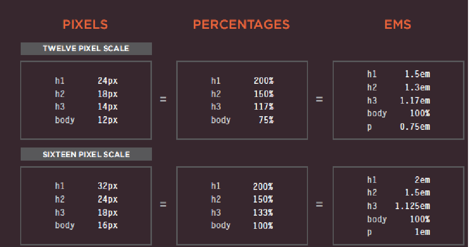

# CH5 Images
## Adding Images 
To add an image into the page you need to use an `````` element. This is an empty element (which means there is no closing tag). It must carry the following two attributes

``````

## Height & Width of Images
**height**
This specifies the height of the image in pixels.
**width**
This specifies the width of the image in pixels.
``````

## Where to Place Images in Your Code
1. before a paragraph
``` <p>There are around 10,000 living species of birds that inhabit different ecosystems from the</p>```
2. inside the start of aparagraph
```<p>There are around 10,000 living species of birds that inhabit different </p>```
3. in the middle of a paragraph
```<p>There are around 10,000 living species of birds.Many species undertake long distance annual migrations, and many more perform shorter irregular journeys.</p>```

## Old Code: Aligning Images Horizontally
1. image in left  side ```<p> pragraph<p/>```
2. image in Right  side 
```<p> paragraph<p/>```

## Old Code: Aligning Images Vertically

1. image in left top```<p>paragraoh<p/>```
2. image in left middle ```<p>paragraoh<p/>```


3. image in left bottom ```<p>paragraoh<p/>```


## Summary
* The `````` element is used to add images to a web page.
* You must always specify a src attribute to indicate the source of an image and an alt attribute to describe the content of an image.
* You should save images at the size you will be using them on the web page and in the appropriate format.
* Photographs are best saved as JPEGs; illustrations or logos that use flat colors are better saved as GIFs.

# CH11 Color

## Foreground Color
```/* color name */```

```h1 {```

```color: DarkCyan;}```

```/* hex code */```

```h2 {```

```color: #ee3e80;}```

```/* rgb value */```

```p {```

```color: rgb(100,100,90);}```

## Background Color
```body {```

```background-color: rgb(200,200,200);}```

```h1 {```

```background-color: DarkCyan;}```

```h2{```

```background-color: #ee3e80;}```

## CSS 3: HSL &  HSLA
```body {```

```background-color: #C8C8C8;```

```background-color: hsl(0,0%,78%);}```
```p {```

```background-color: #ffffff;```

```background-color: hsla(0,100%,100%,0.5);}```


# CH12 Text

## Typeface Terminology
1. Serif
2. Sans-Serif


3. Monospace


4. Cursive


5. Fantasy 


## Specifying Typefaces
The **font-family** property allows you to specify the typeface that should be used for any text inside the element(s) to which a CSS rule applies
```body {```

```font-family: Georgia, Times, serif;}```

## Size of Type
The font-size property enables you to specify a size for the font. There are several ways to specify the size of a font. The most common are:

1. pixels

```body {```

```font-family: Arial, Verdana, sans-serif;```

```font-size: 12px;}```
 
 2. percentages
 ```h1 {```

```font-size: 200%;}``

 3. ems
 ```h2 {```

```font-size: 1.3em;}```

## Units of Type Size



## Underst anding Font Formats

1. font-weight **BOLD** ```.credits { font-weight: bold;}```
2. font-style *ITALIC*  ```.credits { font-style: italic;}```

## UpperCase & LowerCase
The ```text-transform``` property is used to change the case of text giving it one of the following values:

1. **uppercase** This causes the text to appear uppercase.
```h1 {```

```text-transform: uppercase;}```

2. **lowercase** This causes the text to appear lowercase.
```h2 {```

```text-transform: lowercase;}```

3. **capitalize** This causes the first letter of each word to appear capitalized.
```.credits {```

```text-transform: capitalize;}```

## Underline & Strike

The ```text-decoration``` property allows you to specify the following values:

1. **none** ```a {```

```text-decoration: none;}```

2. **underline** ```.credits {```

```text-decoration: underline;}```
3. **overline**

4. **line-through**

5. **blink**

**line-height** use for the vertical space between lines of text.

```p {```

```line-height: 1.4em;}```

## Lett er & Word Spacing

* space between each letter. You can control the space between each letter with the ```letter-spacing``` property.

```h1, h2 {```

```text-transform: uppercase;```

```letter-spacing: 0.2em;}```

* You can also control the gap between words using the ```word-spacing``` property

```.credits {```

```font-weight: bold;```

```word-spacing: 1em;}```

## Alignment

1. **left** This indicates that the text should be left-aligned.
```h1 {```

```text-align: left;}```

2. **right** This indicates that the text should be right-aligned.
```.credits {```

```text-align: right;}```

3. **center** This allows you to center text.
```p {```

```text-align: center;}```

4. **justify** This indicates that every line in a paragraph, except the last line, should be set to take up the full width of the containing box.
```p {```

```text-align: justify;}```

## Vertical Alignment

**Top**
```#six-months {```

```vertical-align: text-top;}```

**and otger values is:**
* baseline
* sub
* super
* top
* text-top
* middle
* bottom
* text-bottom
 
## Indenting Text 
By ```.credits {```

```text-indent: 20px;}```

## first-letter, :first-line
By ```p.intro:first-letter {```

```font-size: 200%;}```

```p.intro:first-line {```

```font-weight: bold;}```

# Summary 
* There are properties to control t XX he choice of font, size, weight, style, and spacing.

* There is a limited choice of fonts that you can assume most people will have installed.

* If you want to use a wider range of typefaces there are several options, but you need to have the right license to
 use them.

* You can control the space between lines of text, individual letters, and words. Text can also be aligned to the 
left, right, center, or justified. It can also be indented.

* You can use pseudo-classes to change the style of an element when a user hovers over or clicks on text, or when they have visited a link.