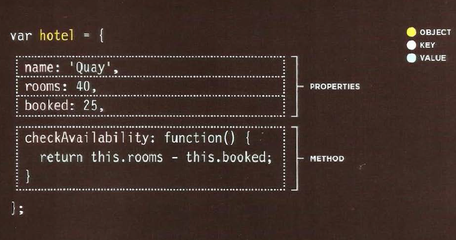
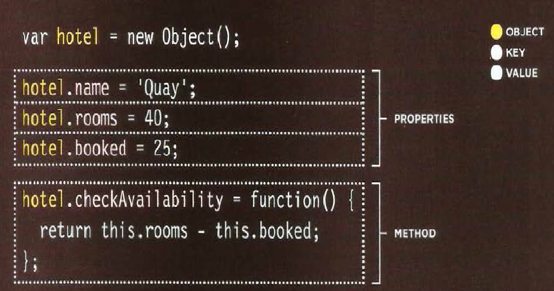
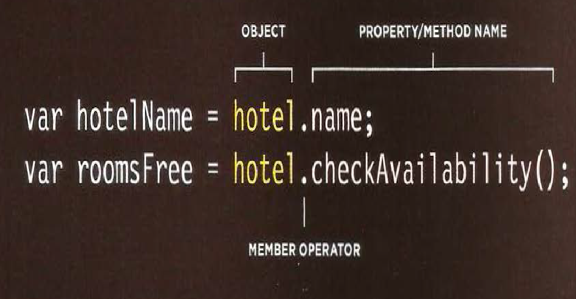

# CH3 OBJECT
**Objects** group together a set of variables and functions to create a model of a something you would recognize from the real world. In an object, variables and functions take on new names.

* IN AN OBJECT: VARIABLES BECOME KNOWN AS **PROPERTIES**

* IN AN OBJECT: FUNCTIONS BECOMEMKNOWN AS **METHODS**

## Methodes to Create Object

1. LITERAL NOTATION



**2.** Constructor Notation 



# Accessing an Object and dot Notation



# CH5 Document Object Model

* THE DOM TREE IS A MODEL OF A WEB PAGE
* As a browser loads a web page, it creates a model of that page. The model is called **a DOM tree** , and it is stored in the browsers' memory.
* It consists of four main types of nodes.
* Each node is an object with methods and properties.

## Tapes of Node
1. the Document NODE
2. ELEMENT NODES
3. ATTRIBUTE NODES
4. TEXT NODES

## Caching Dom Queries 

* Methods that find elements in the DOM tree are called DOM queries. When you need to work with an element more than once, you should use a variable to store the result of this query
* When people talk about storing elements in variables, they are really storing the location of the element(s) within the DOM tree in a variable. The properties and methods of that element node work on the variable.

## Methodes that select Individual Elements 
```getElementById()``` and ```querySelector()``` can both search an entire document and return individual elements. Both use a similar syntax.

## SELECTING AN ELEMENT FROM A NODELIST
There are two ways to select an element from a Nodelist: **The item() method** and **array syntax**.Both require the index number of the element you want.

## REPEATING ACTIONS FOR AN ENTIRE NODELIST
When you have a NodeList, you can loop through each node in the collection and apply the same statements to each

## ADDING OR REMOVING HTML CONTENT 
There are two very different approaches to adding and removing content from a DOM tree: **the innerHTML property** and **DOM manipulation**.


## Summary
1. The browser represents the page using a DOM tree.

2. DOM trees have four types of nodes: document nodes, element nodes, attribute nodes, and text nodes.

3. You can select element nodes by their id or cl ass attributes, by tag name, or using CSS selector syntax.

4. Whenever a DOM query can return more than one node, it will always return a Nadel i st.

5. From an element node, you can access and update its content using properties such as textContent and i nnerHTML or using DOM manipulation techniques.

6. An element node can contain multiple text nodes and child elements that are siblings of each other.

7. In older browsers, implementation of the DOM is inconsistent (and is a popular reason for using jQuery). Browsers offer tools for viewing the DOM tree .