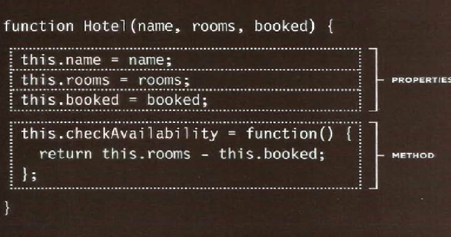
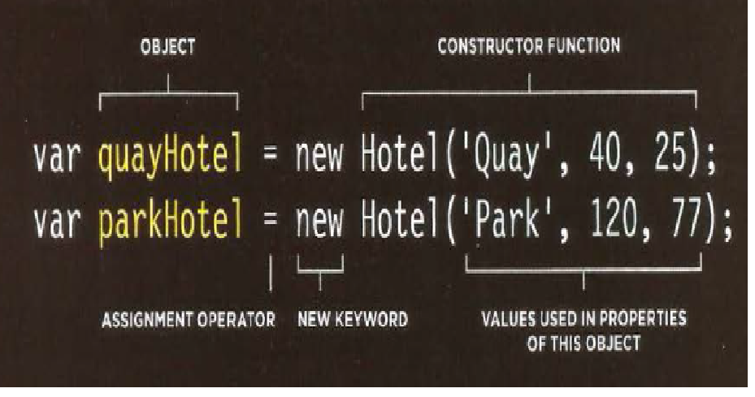

# CH6: HTML Tabels

**What's a Table?**
A table represents information in a grid format. Examples of tables include financial reports, TV schedules, and sports results

## Basic Table St ructure
1. ```<table></table>``` used to creat table The contents of the table are written out row by row.
2. ```<tr></tr>``` indicate the start of each row , *tr* stand for table row
3. ```<td></td>``` used to represent the cell in table , *td* stands for table data 

## Table Headings
* ```<th></th>``` element is used just like the ```<td>``` element but its purpose is to represent the heading for either a column or a row , The *th* stands for table heading.
* Even if a cell has no content, you should still use a ```<td>``` or ```<th>``` element to represent the presence of an empty cell otherwise the table will not render correctly.

* Spanning ColumnS
```<td colspan="numb.of column">text</td>```
* Spanning Rows
```<td rowspan="numb.of row">text</td>```

## Long Tables
three elements that help distinguish between the main content of the table
1. The headings of the table should sit inside the ```<thead>``` element.

2. The body should sit inside the ```<tbody>``` element

3. The footer belongs inside the ```<tfoot>``` element. 

### To adjustment the Width, Spacing, Border & Background of your table You can use  CSS instead of old code of HTML


## Summary
* The ```<table>``` element is used to add tables to a web page.
* A table is drawn out row by row. Each row is created with the ```<tr>``` element.
* Inside each row there are a number of cells represented by the ```<td>``` element (or ```<th> ```if it is a header).
* You can make cells of a table span more than one row or column using the rowspan and colspan attributes.
* For long tables you can split the table into a ```<thead>```, ```<tbody>```, and ```<tfoot>```.

# CH3: Functions, Methods, and Objects

**CREATING AN OBJECT: CONSTRUCTOR NOTATION** 
The new keyword and the object constructor create a blank object. You can then add properties and methods to the object.


- first, you createa new object using a combination of the new keyword and the Object () constructor function. (This function is part of the JavaScript language and is used to create objects.) 

- Next, having created the blank object, you can add properties and methods to it using dot notation. Each statement that adds a property or method should end with a semicolon.
- To create an empty object using literal notation use: ```var hotel={}``` The curly brackets create an empty object.

- To update the value of properties, use dot notation ```object.propertyName='propertyValue' ; ```or square brackets ```object ['propertyName'] = 'propertyValue ' ; ```. They work on objects created using literal or constructor notation. 
- To delete a property, use the delete keyword ```delete object.propertyName ;```
- If you just want to clear the value of a property, you could set it to a blank string ```object.propertyName = ' ' ```

**CREATING MANY OBJECTS: CONSTRUCTOR NOTATION**
Object constructors can use a function as a template for creating objects. First, create the template with the object's properties and methods



- A function called Hotel will be used as a template for creating new objects that represent hotels. Like all functions, it contains statements. In this case, they add properties or methods to the object.

- The function has three parameters. Each one sets the value of a property in the object. The methods will be the same for each object created using this function.

- The new keyword followed by a call to the function creates a new object. The properties of each object are given as arguments to the function. 



## Arrays are Object !!
Arrays are actually a special type of object. They hold a related set of key/value pairs (like all objects), but the **key for each value is its index number**.

**ARRAYS OF OBJECTS & OBJECTS IN ARRAYS**You can combine arrays and objects to create complex data structures: Arrays can store a series of objects (and remember their order). Objects can also hold arrays (as values of their properties)

## Groups of Built-in Object
1. BROWSER OBJECT MODEL
2. DOCUMENT OBJECT MODEL 
3. GLOBAL JAVASCRIPT OBJECTS

## CREATING AN INSTANCE OF THE DATE OBJECT
* In order to work with dates, you create an instance of the Date object. You can then specify the time and date that you want it to represent.

* By default, when you create a Date object it will hold today's date and the current time. If you want it to store another date, you must explicitly specify the date and time you want it to hold.
```var today = new Date (); ```

# Summary
* Functions allow you to group a set of related statements together that represent a single task.

* Functions can take parameters (informatiorJ required to do their job) and may return a value.

* An object is a series of variables and functions that represent something from the world around you.

* In an object, variables are known as properties of the object; functions are known as methods of the object.

* Web browsers implement objects that represent both the browser window and the document loaded into the browser window.

* JavaScript also has several built-in objects such as String, Number, Math, and Date. Their properties and methods offer functionality that help you write scripts.

* Arrays and objects can be used to create complex data sets (and both can contain the other).
