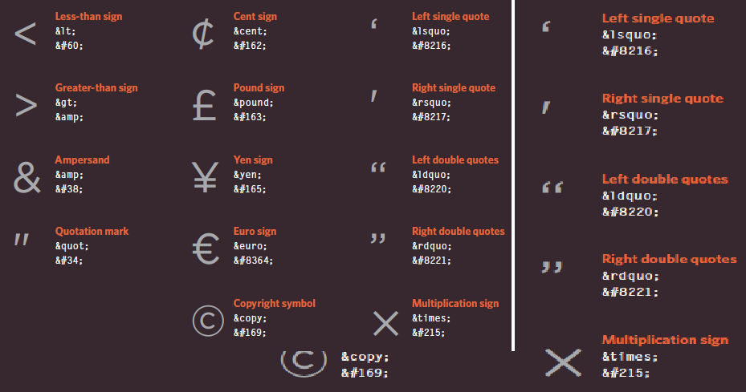

# Introduction
## How the Web Works
1. When you connect to the web, you do so via an Internet Service Provider (ISP). You type a domain name or web address into your browser to visit a site; for example: google.com, bbc.co.uk, microsoft.com.
 2. Your computer contacts a network of servers called Domain Name System (DNS) servers. These act like phone books; they tell your computer the IP address associated with the requested domain name. An IP address is a number of **up to 12 digits separated by periods / full stops.** **Every device connected to the web has a unique IP address**; it is like the phone number for that computer.
 3. The unique number that the DNS server returns to your computer allows your browser to contact the web server that hosts the website you requested. A web server is a computer that is constantly connected to the web, and is set up especially to send web pages to users.
 4. The web server then sends the page you requested back to your web browser.


# CH1: Structure
## HTM L Us es El ements to Describe the Structure of Pages
* Let's look closer at the code from the last page.There are several different elements. Each element has an opening tag and a closing tag.
* **Tags:** act like containers. They tell you something about the information that lies between their opening and closing tags, Opening tag **<P>** and Closing tag **</p>**
* **Attributes** provide additional information about the contents of an element. They appear on the opening tag of the element and are made up of two parts:**name* and a **value** separated by an equals sign.
```<p lang="fr">Paragraphe en Français</p>``` 
lang : name of The the Attribute,value of the lang attribute
is an abbreviated way of specifying which language is used inside the element that all browsers understand.
   - Most attribute values are either pre-defined or follow a stipulated format. We will look at the permitted values as we introduce each new attribute
   - The majority of attributes can only be used on certain elements, although a few attributes (such as lang) can appear on any element
## Summary
1. HTML p XX ages are text documents.
2. HTML uses tags (characters that sit inside angled brackets) to give the information they surround special meaning.
3. Tags are often referred to as elements.
4. Tags usually come in pairs. The opening tag denotes the start of a piece of content; the closing tag denotes the end.
5. Opening tags can carry attributes, which tell us more about the content of that element.
6. Attributes require a name and a value.
7. To learn HTML you need to know what tags are available for you to use, what they do, and where they can go.

# CH8 Extra Markup

## DOCTYPEs : 
There is several versions of HTML, each web page should begin with a DOCTYPE declaration to tell a browser which version of HTML the page is using(although browsers usually display the page even if it is not included).
* HTML5 version :```<!DOCTYPE html>``` 
* HTML4 version: ``` <!DOCTYPE html PUBLIC "-//W3C//DTD HTML 4.01 Transitional//EN" "http://www.w3.org/TR/html4/loose.dtd"> ```
* Transitional XHTML 1.0 ``` <!DOCTYPE html PUBLIC "-//W3C//DTD XHTML 1.0 Transitional//EN" "http://www.w3.org/TR/xhtml1/DTD/ xhtml1-transitional.dtd">```
* Strict XHTML 1.0: ```<!DOCTYPE html PUBLIC "-//W3C//DTD XHTML 1.0 Strict//EN" "http://www.w3.org/TR/xhtml1/DTD/ xhtml1-strict.dtd"> ``` 
* XML Declaration : ```<?xml version="1.0" ?> ```

## Comment in HTML 
Although comments are not visible to users in the main browser window, they can be viewed by anyone who looks at the source code behind the page BY ```<!-- comment goes here -->```

## ID Attribute
* The id attribute is known as a global attribute because it can be used on any element
* Every HTML element can carry the id attribute.  
* It is used to uniquely identify that element from other elements on the page. 
* Its value should start with a letter or an underscore (not a number or any other character). 
* It is important that no two elements on the same page have the same value for their id attributes (otherwise the value is no longer unique).


## Class Attribute
* The class attribute on any element can share the same value.
* to identify several elements as being different from the other elements on the page.
* To do this you can use the class attribute. Its value should describe the class it belongs to.
 

## Block Elements
Some elements will always appear to start on a new line in the browser window. These are known as **block level** elements.
Examples of block elements are ```<h1>, <p>, <ul>, and <li>```

## Inline Elements
* Some elements will always appear to continue on the same line as their neighbouring elements. These are known as inline elements.
* Examples of inline elements are ```<a>, <b>, <em>, and ```


## Grouping Text & Elements In a Block
* The ```<div>``` element allows you to group a set of elements together in one block-level box.

## Grouping Text & Elements Inline
The <span> element acts like an inline equivalent of the <div> element. It is used to either:
1. Contain a section of text where there is no other suitable element to differentiate it from its surrounding text
2. Contain a number of inline elements

## IFrames
An ```<iframe>``` is like a little window that has been cut into your page — and in that window you can see another page. The term iframe is an abbreviation of inline frame.

## Add Information About Your Pages : by <meta>
The <meta> element lives inside the <head> element and contains information about that web page and It is not visible to users

## Escape Characters
* There are some characters that are used in and reserved by HTML code. (For example, the
 eft and right angled brackets.)


## Summary

* DOCTYPES tell browsers which version of HTML you
are using.
* You can add comments to your code between the ```<!-- and -->``` markers.
* The id and class attributes allow you to identify particular elements.
* The <div> and <span> elements allow you to group block-level and inline elements together.
* <iframes> cut windows into your web pages through which other pages can be displayed.
* The <meta> tag allows you to supply all kinds of information about your web page.
* Escape characters are used to include special characters in your pages such as <, >, and ©.


# CH17 HTML5 Layout
## Headers & Footers
The ```<header>``` and ```<footer>```elements can be used for:
* The main header or footer that appears at the top or bottom of every page on the site.
* A header or footer for an individual ```<article>``` or ```<section>``` within the page.

## Navigation
The ```<nav>``` element is used to contain the major navigational blocks on the site such as the primary site navigation

## Articles
The ```<article>``` element acts as a container for any section of a page that could stand alone and potentially be syndicated

## rticle
The ```<aside>``` element has two purposes, depending on whether it is inside an ```<article>``` element or not.
* When the ```<aside>``` element is used inside an ```<article>``` element, it should contain information that is related to the article but not essential to its overall meaning
* When the ```<aside>``` element is used outside of an ```<article>``` element, it acts as a container for content that is related to the entire page

## Summary

* The new HTML5 elements i XX ndicate the purpose of different parts of a web page and help to describe its structure.
* The new elements provide clearer code (compared with using multiple <div> elements).
* Older browsers that do not understand HTML5 elements need to be told which elements are block-level elements.
* To make HTML5 elements work in Internet Explorer 8 (and older versions of IE), extra JavaScript is needed, which is available free from Google.

# CH18 Process & Design

## Site Maps
what needs to appear on your site, you can start to organize the information into sections or pages

## WireFrames 
A wireframe is a simple sketch of the key information that needs to go on each page of a site. It shows the hierarchy of the information and how much space it might require


## Summary

* It's important to understand who your target audience is, why they would come to your site, what information they want to find and when they are likely to return.
* Site maps allow you to plan the structure of a site.
* Wireframes allow you to organize the information that will need to go on each page.
* Design is about communication. Visual hierarchy helps visitors understand what you are trying to tell them.
* You can differentiate between pieces of information using size, color, and style.
* You can use grouping and similarity to help simplify the information you present.


# The ABC of Programming
## What is a script and how do I create one?
* A script is a series of instructions that the computer can follow in order to achieve a goal.
* Each time the script runs, it might only use a subset of all the instructions.
* Computers approach tasks in a different way than humans, so your instructions must let the computer solve the task prggrammatically.
* To approach writing a script, break down your goal into a series of tasks and then work out each step needed to complete that task (a flowchart can help).

## HOW A BROWSER SEES A WEB PAGE
1. RECEIVE A PAGE AS HTML CODE
2. CREATE A MODEL OF THE PAGE AND STORE IT IN MEMORY
3. USE A RENDERING ENGINE TO SHOW THE PAGE ON SCREEN

##  How do computers fit in with the world around them? 
* Computers create models of the world using data. 
* The models use objects to represent physical things. Objects can have: properties that tell us about the object; methods that perform tasks using the properties of that object; events which are triggered when a user interacts with the computer.
* Programmers can write code to say "When this event occurs, run that code." Web browsers use HTML markup to create a model of the web page. 
*  Each element creates its own node (which is a kind of object). 
*  To make web pages interactive, you write code that uses the browser's model of the web page.

## JAVASCRIPT RUNS WHERE IT IS FOUND IN THE HTML
*When the browser comes across a ```<script>``` element, it stops to load the script and then checks to see if it needs to do anything.*


* It is best to keep JavaScript code in its own JavaScript file. JavaScript files are text files (like HTML pages and CSS style sheets), but they have the . j s extension.
* The HTML ```<script>``` element is used in HTML pages to tell the browser to load the JavaScript file (rather like the ```<link>``` element can be used to load a CSS file).

* If you view the source code of the page in the browser, the JavaScript will not have changed the HTML, because the script works with the model of the web page that the browser has created.