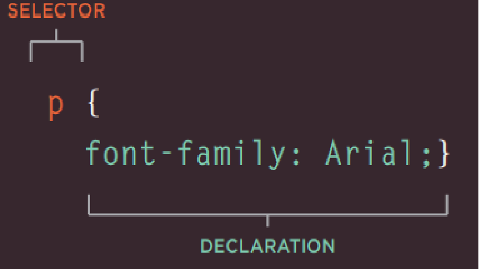

# CH10 Introducing CSS
## CSS works by associating rules with HTML elements. These rules govern
how the content of specified elements should be displayed. A CSS rule
contains two parts: a selector and a declaration.

**Selectors** indicate which element the rule applies to.

**Declarations** indicate how the elements referred to in the selector should be styled. Declarations are split into two : parts (a property and a value), and are separated by a colon.

 

## CSS Properties Affect How Elements Are Displayed
CSS declarations sit inside curly brackets and each is made up of two
parts: a property and a value, separated by a colon. You can specify
several properties in one declaration, each separated by a semi-colon.

**Properties** indicate the aspects of the element you want to change. For example, color, font, width, height and border.

**Values** specify the settings you want to use for the chosen properties. For example, if you want to specify a color property then the value is the color you want the text in these elements to be.

* CSS rules usually appear in a separate document,
although they may appear within an HTML page

# CH11 Color

## Foreground Color 
There are three ways of determining color:
1. **rgb values** Values for red, green, and blue are expressed as numbers between 0 and 255. 

rgb(102,205,170) This color is made up of the following values:

- 102 red 

- 205 green 

- 170 blue 

**2.** **hex codes** Hex values represent values for red, green, and blue in hexadecimal code.
#66cdaa
The value of the red, 102, is expressed as 66 in hexadecimal code. The 205 of the green is expressed as cd and the 170 of the blue equates to aa.

**3.** **color names** MediumAquaMarine There are 147 color names supported by browsers (this color is MediumAquaMarine). Most consider this to be a limited color palette, and it is hard to remember the name for each of the colors so (apart from white and black) they are not commonly used.

## Background Color
* By default, most browser windows have a white background, but browser users can set a background color for their windows, so if you want to be sure that the background is white you can use the background-color property on the <body> elemen
* The color of every pixel on the screen is expressed in terms of a mix of red, green, and blue — just like on a television screen.
 

## CSS3: HSL Colors
CSS3 introduces an entirely new and intuitive way to specify colors using hue, saturation, and lightness values.

- HUE: Hue is the colloquial idea of color. In HSL colors, hue is often represented as a color circle where the angle represents the color, although it may also be shown as a slider with values from 0 to 360.
 

- Saturation: Saturation is the amount of gray in a color. Saturation is represented as a percentage. 100% is full saturation and 0% is a shade of gray

- Brightness: Lightness is the amount of white (lightness) or black (darkness) in a color. Lightness is represented as a percentage. 0% lightness is black, 100% lightness is white, and 50% lightness is normal. Lightness is sometimes referred to as luminosity

## Summary
* Color not only brings your site to life, but also helps convey the mood and evokes reactions.

* There are three ways to specify colors in CSS: RGB values, hex codes, and color names.

* Color pickers can help you find the color you want.

* It is important to ensure that there is enough contrast between any text and the background color (otherwise people will not be able to read your content).

* CSS3 has introduced an extra value for RGB colors to indicate opacity. It is known as RGBA.

* CSS3 also allows you to specify colors as HSL values, with an optional opacity value. It is known as HSLA.